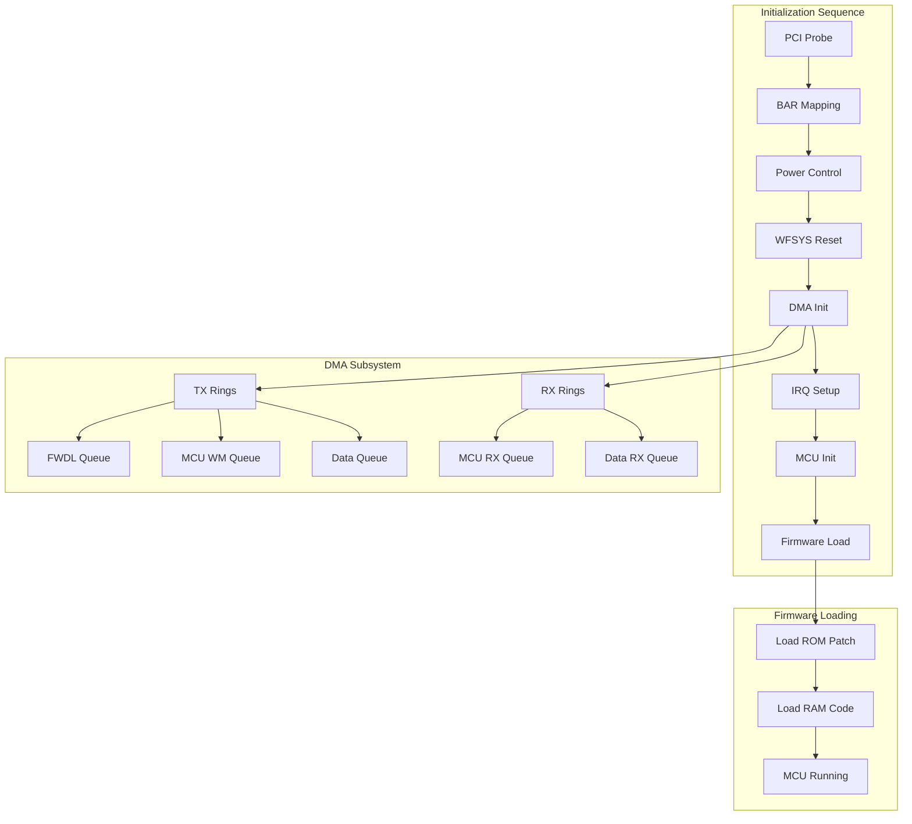

# MT7927 DMA Transfer Implementation Plan

## Current State Analysis

The project has made significant progress:

- Driver binds to MT7927 PCI device (14c3:7927)
- BAR0/BAR2 memory mapping works
- MT7925 firmware files are compatible and loadable into kernel memory
- Chip responds (FW_STATUS: 0xffff10f1 = waiting for firmware)
- **MT7927 confirmed as MT6639 variant** (MediaTek kernel modules)
- **Ring 15/16 assignments validated** (MT6639 architecture)

**Root Cause of Blocker (FOUND 2026-01-31)**: MT7927 ROM bootloader does NOT support mailbox command protocol! The driver was waiting for mailbox responses that the ROM never sends.

**Solution**: Use polling-based firmware loading:
1. Skip semaphore command (ROM doesn't support it)
2. Send firmware chunks without waiting for mailbox responses
3. Use time-based delays (5-50ms) instead of mailbox waits
4. Set SW_INIT_DONE bit manually instead of FW_START command

See [ZOUYONGHAO_ANALYSIS.md](ZOUYONGHAO_ANALYSIS.md) for complete implementation details.

## Architecture Overview




## Implementation Tasks

### Phase 1: Core Infrastructure

#### 1.1 Register Mapping Layer

Create proper register access with address remapping (as mt7925 does).

Key reference: `[reference/linux/drivers/net/wireless/mediatek/mt76/mt7925/pci.c](reference/linux/drivers/net/wireless/mediatek/mt76/mt7925/pci.c)` lines 105-187

```c
// Fixed register map from mt7925 - critical for accessing hardware blocks
static const struct mt76_connac_reg_map fixed_map[] = {
    { 0x830c0000, 0x000000, 0x0001000 }, /* WF_MCU_BUS_CR_REMAP */
    { 0x54000000, 0x002000, 0x0001000 }, /* WFDMA PCIE0 MCU DMA0 */
    // ... more mappings
};
```

- Create `mt7927_regs.h` with register definitions adapted from `[reference/linux/drivers/net/wireless/mediatek/mt76/mt7925/regs.h](reference/linux/drivers/net/wireless/mediatek/mt76/mt7925/regs.h)`
- Implement `mt7927_reg_map_l1()` and `mt7927_reg_map_l2()` for address translation
- Add register read/write wrappers with proper remapping

#### 1.2 Power Management Control

The chip requires a power management handshake before accepting commands.

Key reference: `[reference/linux/drivers/net/wireless/mediatek/mt76/mt7925/pci.c](reference/linux/drivers/net/wireless/mediatek/mt76/mt7925/pci.c)` lines 384-390

```c
ret = __mt792x_mcu_fw_pmctrl(dev);  // Give control to firmware
ret = __mt792xe_mcu_drv_pmctrl(dev); // Take control back to driver
```

- Implement `mt7927_mcu_fw_pmctrl()` - release control to firmware
- Implement `mt7927_mcu_drv_pmctrl()` - acquire control from firmware
- Add EMI control initialization (`MT_HW_EMI_CTL` register)

#### 1.3 WiFi System Reset

The chip must be reset before firmware loading.

Key reference: `[reference/linux/drivers/net/wireless/mediatek/mt76/mt7925/pci.c](reference/linux/drivers/net/wireless/mediatek/mt76/mt7925/pci.c)` line 399

- Implement `mt7927_wfsys_reset()` using `MT_WFSYS_SW_RST_B` (0x7c000140)
- Add proper reset timing and status polling

### Phase 2: DMA Queue Implementation

#### 2.1 DMA Descriptor Ring Structures

Create proper queue structures following mt76 patterns.

Key reference: `[reference/linux/drivers/net/wireless/mediatek/mt76/mt7925/pci.c](reference/linux/drivers/net/wireless/mediatek/mt76/mt7925/pci.c)` lines 213-267

```c
// Ring configuration from mt7925
#define MT7925_TX_RING_SIZE        2048
#define MT7925_TX_MCU_RING_SIZE    256
#define MT7925_TX_FWDL_RING_SIZE   128
#define MT7925_RX_RING_SIZE        1536
#define MT7925_RX_MCU_RING_SIZE    512
```

- Create `mt7927_queue` structure with descriptor ring, DMA addresses, indices
- Implement `mt7927_queue_alloc()` for ring allocation
- Implement `mt7927_queue_free()` for cleanup

#### 2.2 TX Queue Initialization

Initialize transmit queues including firmware download queue.

Required queues:

- **FWDL Queue** (MT7925_TXQ_FWDL = 16): For firmware scatter commands
- **MCU WM Queue** (MT7925_TXQ_MCU_WM = 15): For MCU commands
- **Data Queue** (MT7925_TXQ_BAND0 = 0): For WiFi data (later)
- Implement `mt7927_init_tx_queues()` with proper ring base addresses
- Configure `MT_WFDMA0_TX_RING*_EXT_CTRL` registers

#### 2.3 RX Queue Initialization

Initialize receive queues for MCU responses.

Required queues:

- **MCU RX Queue** (MT7925_RXQ_MCU_WM = 0): For MCU responses
- **Data RX Queue** (MT7925_RXQ_BAND0 = 2): For WiFi data (later)
- Implement `mt7927_init_rx_queues()` with proper buffer allocation
- Configure RX ring registers

#### 2.4 DMA Enable/Disable

Proper DMA control sequence.

- Implement `mt7927_dma_disable()` - stop DMA, wait for idle
- Implement `mt7927_dma_enable()` - configure and start DMA
- Use `MT_WFDMA0_GLO_CFG` with proper TX/RX DMA enable bits

### Phase 3: MCU Protocol Implementation

#### 3.1 MCU Message Structure

Implement the MCU communication protocol.

Key reference: `[reference/linux/drivers/net/wireless/mediatek/mt76/mt7925/mcu.h](reference/linux/drivers/net/wireless/mediatek/mt76/mt7925/mcu.h)` lines 26-42

```c
struct mt7925_mcu_rxd {
    __le32 rxd[8];
    __le16 len;
    __le16 pkt_type_id;
    u8 eid;
    u8 seq;
    // ...
};
```

- Create `mt7927_mcu.h` with message structures
- Define MCU command IDs (FW_SCATTER, PATCH_SEM_CONTROL, etc.)

#### 3.2 MCU Message Send/Receive

Implement message transmission via DMA queues.

Key reference: `[reference/linux/drivers/net/wireless/mediatek/mt76/mt7925/pci_mcu.c](reference/linux/drivers/net/wireless/mediatek/mt76/mt7925/pci_mcu.c)` lines 7-25

```c
static int mt7925_mcu_send_message(struct mt76_dev *mdev, struct sk_buff *skb,
                                   int cmd, int *seq) {
    if (cmd == MCU_CMD(FW_SCATTER))
        txq = MT_MCUQ_FWDL;  // Use firmware download queue
    return mt76_tx_queue_skb_raw(dev, mdev->q_mcu[txq], skb, 0);
}
```

- Implement `mt7927_mcu_send_msg()` with proper header formatting
- Implement `mt7927_mcu_wait_response()` for synchronous commands
- Add sequence number tracking

#### 3.3 Firmware Download Protocol

Implement the actual firmware transfer sequence.

The firmware download follows this protocol:

1. Acquire patch semaphore (MCU_CMD_PATCH_SEM_CONTROL)
2. Send firmware in chunks via FW_SCATTER command
3. Signal patch finish (MCU_CMD_PATCH_FINISH_REQ)
4. Load RAM code similarly
5. Release semaphore

- Implement `mt7927_load_patch()` for ROM patch loading
- Implement `mt7927_load_ram()` for RAM code loading
- Add proper chunking for large firmware files

### Phase 4: Interrupt Handling

#### 4.1 IRQ Handler

Process DMA completion interrupts.

Key reference: `[reference/linux/drivers/net/wireless/mediatek/mt76/mt7925/pci.c](reference/linux/drivers/net/wireless/mediatek/mt76/mt7925/pci.c)` lines 298-308

```c
static const struct mt792x_irq_map irq_map = {
    .host_irq_enable = MT_WFDMA0_HOST_INT_ENA,
    .tx = { .all_complete_mask = MT_INT_TX_DONE_ALL, ... },
    .rx = { .data_complete_mask = HOST_RX_DONE_INT_ENA2, ... },
};
```

- Implement `mt7927_irq_handler()` for interrupt processing
- Add tasklet for deferred interrupt handling
- Configure interrupt enable/disable registers

#### 4.2 TX/RX Completion

Handle DMA transfer completions.

- Implement `mt7927_tx_complete()` for TX ring cleanup
- Implement `mt7927_rx_poll()` for RX processing
- Add proper descriptor index management

### Phase 5: Integration and Testing

#### 5.1 Unified Driver Module

Create the complete driver combining all components.

File structure:

```
src/
├── mt7927.h           # Main header with structures
├── mt7927_regs.h      # Register definitions
├── mt7927_mcu.h       # MCU protocol definitions
├── mt7927_pci.c       # PCI probe, DMA init
├── mt7927_mcu.c       # MCU communication
├── mt7927_dma.c       # DMA queue management
└── Makefile           # Build configuration
```

#### 5.2 Test Modules

Create incremental test modules for validation.

- `test_power_ctrl.c`: Test power management handshake
- `test_wfsys_reset.c`: Test WiFi system reset
- `test_dma_queues.c`: Test DMA ring allocation and configuration
- `test_mcu_basic.c`: Test basic MCU message exchange
- `test_fw_load.c`: Test complete firmware loading sequence

#### 5.3 Integration Test

Full initialization test with firmware loading.

Success criteria:

- FW_STATUS changes from 0xffff10f1 to running state
- MCU responds to commands
- Memory at BAR0[0x000000] activates

## Key Files to Create/Modify


| File                 | Purpose                                  |
| -------------------- | ---------------------------------------- |
| `src/mt7927.h`       | Main header with device structures       |
| `src/mt7927_regs.h`  | Register definitions (adapt from mt7925) |
| `src/mt7927_mcu.h`   | MCU protocol definitions                 |
| `src/mt7927_pci.c`   | PCI driver with DMA init                 |
| `src/mt7927_mcu.c`   | MCU communication and firmware loading   |
| `src/mt7927_dma.c`   | DMA queue management                     |
| `tests/05_dma_impl/` | New test directory for DMA tests         |


## Implementation Order

The implementation should proceed in this order to enable incremental testing:

1. Register mapping layer (enables proper hardware access)
2. Power management (required before any other operations)
3. WiFi system reset (prepares chip for firmware)
4. DMA queue allocation (provides transport)
5. IRQ handling (enables completion detection)
6. MCU message protocol (enables firmware commands)
7. Firmware download (final goal)

## Risk Mitigation

- Use the same register addresses as mt7925 initially (chips are architecturally identical)
- Add extensive debug logging at each step
- Create recovery procedures for each failure mode
- Test incrementally - verify each component before proceeding

